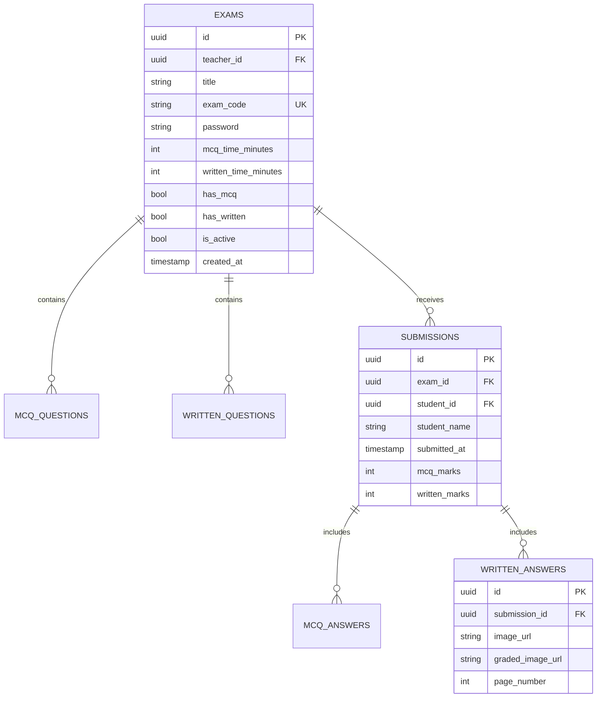

# ⚡ Exam Rush Hour

<div align="center">

  

  <h3>The Modern, Dual-Mode Online Examination & Digital Evaluation Platform</h3>

  <p align="center">
    A comprehensive, cross-platform Flutter application powering seamless online assessments — featuring automated MCQ scoring and digital script evaluation with an in-app drawing board for teachers.
  </p>

  <p align="center">
    <a href="https://flutter.dev">
      
    </a>
    <a href="https://dart.dev">
      
    </a>
    <a href="https://supabase.com">
      
    </a>
    <a href="https://riverpod.dev">
      
    </a>
    <a href="https://github.com/saiful16164/Exam-Rush-Hour/blob/main/LICENSE">
      
    </a>
  </p>

  <p align="center">
    <a href="#-key-features">Key Features</a> •
    <a href="#-system-architecture">Architecture</a> •
    <a href="#-tech-stack">Tech Stack</a> •
    <a href="#-database-design">Database Schema</a> •
    <a href="#-getting-started">Getting Started</a> •
    <a href="#-portfolio-highlights">Portfolio Highlights</a>
  </p>
</div>

---

## 📖 Overview

**Exam Rush Hour** bridges the gap between traditional pen-and-paper assessments and modern digital exams. Built from the ground up using **Flutter** and **Supabase**, it provides institutions, teachers, and students with an end-to-end examination ecosystem.

Whether handling high-speed **Multiple Choice Questions (MCQs)** with automated instant grading or high-stakes **Written Subjective Exams** requiring photo submission and manual script evaluation, Exam Rush Hour delivers a reliable, intuitive experience.

---

## ✨ Key Features

### 👨‍🏫 Teacher Portal
- **Role-Based Authentication**: Secure sign-up and login powered by Supabase Auth with dedicated teacher roles.
- **Smart Exam Creator**:
  - Configure exam title, description, time limits, and unique passcode-protected exam codes.
  - Multi-step exam creator: configure basic details, add MCQs, and upload written question papers (PDFs / High-res Images).
  - Activate or deactivate exams on the fly.
- **Interactive Script Evaluation (Digital Pen Board)**:
  - Custom digital annotation canvas with **red pen marking, stroke width control, rotation, zoom, and undo**.
  - Review submitted student answer sheets page-by-page.
  - Save graded scripts with visual annotations directly into cloud storage.
  - Assign written marks and submit finalized evaluation reports.
- **Real-Time Results & Analytics Dashboard**:
  - Live submission tracking with student details and submission timestamps.
  - Automated MCQ calculation coupled with evaluated written scores.
  - Easy deletion and management of test records.

### 🎓 Student Experience
- **Dedicated Student Space**: Seamless role-based onboarding with personalized dashboard.
- **Quick Exam Access**: Join exams instantly via unique alphanumeric Exam Code and access password.
- **Dynamic Dual-Mode Testing**:
  - **MCQ Interface**: Responsive question navigation grid, live countdown timer, auto-save state, and automated grading upon submission.
  - **Written Exam Room**: Integrated in-app question viewer (PDF/Image), live timer, and multi-page answer sheet upload via gallery/file picker.
- **Instant Result Portal**: Detailed score breakdowns, marked written answer sheets view, and feedback.

---

## 🛠️ Tech Stack & Architecture

| Layer | Technology | Purpose |
| :--- | :--- | :--- |
| **Framework** | [Flutter](https://flutter.dev) (v3.8+) | Cross-platform UI for Web, Android, iOS, & Desktop |
| **Language** | [Dart](https://dart.dev) (v3.0+) | Strongly-typed, reactive application code |
| **State Management** | [Riverpod 2.x](https://riverpod.dev) + Riverpod Generator | Declarative, compile-safe reactive state |
| **Routing** | [GoRouter](https://pub.dev/packages/go_router) | Declarative URL-based deep linking & route guards |
| **Backend & Auth** | [Supabase](https://supabase.com) | PostgreSQL database, Authentication, & Row Level Security |
| **Cloud Storage** | Supabase Storage Buckets | Question papers & student answer scripts (Images/PDFs) |
| **Document Viewer** | Syncfusion Flutter PDF Viewer | High-performance client-side PDF rendering |
| **Design System** | Material 3 + Google Fonts (Inter) | Modern educational UI with custom styling |

---

## 📂 Project Structure

```text
lib/
├── main.dart                  # App entry point, Supabase initialization & themes
├── router.dart                # GoRouter routing declarations & role guards
├── supabase_config.dart       # Supabase credentials and client configurations
├── models/                    # Data models with JSON serialization
│   ├── exam.dart              # Exam entity schema
│   ├── mcq_question.dart      # MCQ question and options schema
│   ├── written_question.dart  # Written exam question paper metadata
│   ├── submission.dart        # Student submission record
│   └── student.dart           # Student profile details
├── providers/                 # Riverpod business logic & state providers
│   ├── auth_provider.dart     # Authentication state & role routing
│   ├── exam_provider.dart     # Exam queries and state management
│   ├── mcq_state_provider.dart# MCQ timer & selection state
│   └── written_state_provider.dart # Written exam submission state
├── screens/                   # Presentation layer split by role
│   ├── student/               # Student views (Dashboard, MCQ, Written, Results)
│   └── teacher/               # Teacher views (Dashboard, Create Exam, Evaluation)
├── services/                  # Supabase API & Cloud storage services
│   ├── exam_service.dart      # Exam CRUD operations
│   ├── storage_service.dart   # File uploads/downloads (PDF & Images)
│   └── submission_service.dart# MCQ evaluation & script submissions
└── widgets/                   # Reusable modular UI components
    ├── drawing_board.dart     # Custom canvas for digital script marking
    ├── countdown_timer.dart   # Exam timekeeper component
    └── pdf_viewer_widget.dart # In-app PDF question paper viewer
```

---

## 🗄️ Database Design

The PostgreSQL database hosted on Supabase manages relationships across exams, questions, submissions, and evaluated scripts:



---

## 🚀 Getting Started

### Prerequisites
- [Flutter SDK](https://docs.flutter.dev/get-started/install) (3.8 or higher)
- [Dart SDK](https://dart.dev/get-dart) (compatible with Flutter)
- A [Supabase](https://supabase.com) project with Authentication, Database, and Storage enabled.

### 1. Clone the Repository
```bash
git clone https://github.com/saiful16164/Exam-Rush-Hour.git
cd Exam-Rush-Hour
```

### 2. Configure Environment & Supabase
Create or update `lib/supabase_config.dart` with your Supabase credentials:
```dart
const supabaseUrl = 'YOUR_SUPABASE_PROJECT_URL';
const supabaseAnonKey = 'YOUR_SUPABASE_ANON_KEY';
```

Ensure your Supabase project includes a public storage bucket named:
- `exam_files` (for question papers and student answer submissions)

### 3. Install Dependencies
```bash
flutter pub get
```

### 4. Run Code Generation (Riverpod)
```bash
dart run build_runner build --delete-conflicting-outputs
```

### 5. Launch the Application
```bash
# Run on Web (Chrome)
flutter run -d chrome

# Run on Android / iOS
flutter run
```

---

## 💼 Portfolio Highlights

> **Looking to review this project for engineering roles or contracts?**

- **Custom Digital Evaluation System**: Designed a custom Flutter canvas drawing engine (`DrawingBoard`) with matrix transformations (pan, zoom, rotation) and stroke recording, enabling educators to mark and annotate handwritten answer sheets natively on mobile or web.
- **Resilient Real-Time Assessment**: Implemented fault-tolerant state recovery with Riverpod and auto-submitting timers, safeguarding student submissions against unexpected network interruptions.
- **Serverless Cloud Architecture**: Built on top of Supabase Auth, PostgreSQL, and Cloud Storage, achieving low-latency multi-tenant performance without dedicated backend infrastructure costs.
- **Clean Architecture**: Strict separation of concerns (Models -> Services -> Riverpod Notifiers -> Declarative UI), ensuring high testability and maintainability.

---

## 📄 License

This project is licensed under the [MIT License](LICENSE).

---

<div align="center">
  Developed with ❤️ by <a href="https://github.com/saiful16164"><b>Saiful Islam</b></a>
</div>
